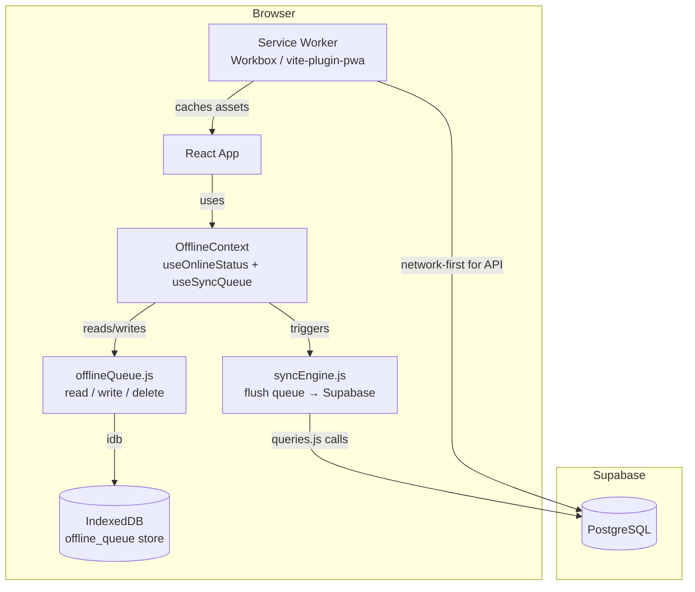
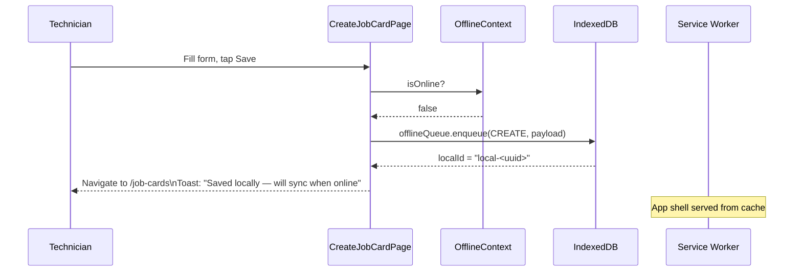
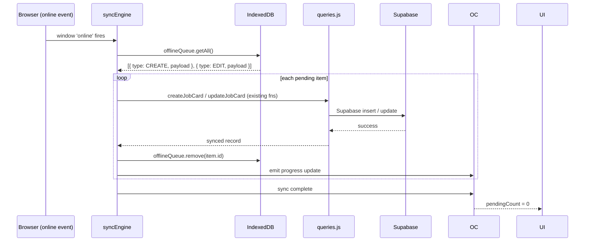
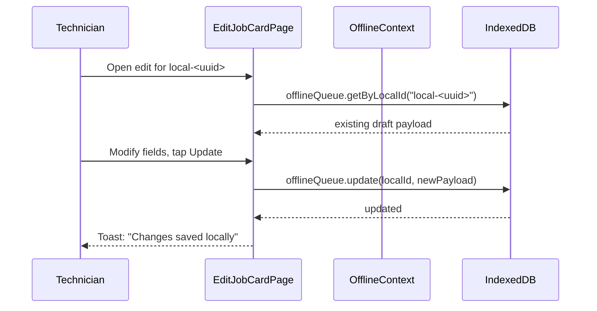

# Design Document: Offline Support for Pioneer Job Cards App

## Overview

This feature adds offline capabilities to the existing React + Vite + Supabase job card PWA so that workshop technicians can continue creating and editing job cards even when the workshop has no internet connectivity. The approach uses a Vite PWA plugin (backed by Workbox) for asset caching and a local IndexedDB store (via `idb`) as an offline queue, with automatic background sync when connectivity is restored.

The design is intentionally additive — it wraps the existing `queries.js` layer rather than rewriting it, so all existing Supabase calls remain unchanged for the online path. Offline-aware versions of the two write operations (create and edit job card) are introduced alongside a sync engine and a lightweight React context that exposes connectivity and sync state to the UI.

---

## Architecture



### Key Design Decisions

| Decision | Choice | Rationale |
|---|---|---|
| Asset caching | `vite-plugin-pwa` + Workbox | Zero-config SW generation; integrates with Vite build pipeline |
| Local store | IndexedDB via `idb` | Structured storage; survives page reload; handles large payloads |
| Sync trigger | `online` event + page focus | Simple, reliable; no background sync API needed |
| Conflict strategy | Last-write-wins on sync | Acceptable for a single-workshop app; no concurrent editors |
| Offline job card IDs | `crypto.randomUUID()` prefixed `local-` | Distinguishes unsynced records; avoids collisions with Supabase UUIDs |
| Service worker scope | App shell + static assets only | Supabase REST calls remain network-first; no stale data risk |

---

## Sequence Diagrams

### Create Job Card — Offline Path



### Auto-Sync on Reconnect



### Edit Unsynced Job Card — Offline Path



---

## Components and Interfaces

### `src/lib/offlineQueue.js`

**Purpose**: Thin wrapper around IndexedDB that stores pending create/edit operations.

**Interface**:
```javascript
// Queue item shape stored in IndexedDB
// {
//   id: string,           // auto-generated IDB key
//   localId: string,      // "local-<uuid>" for CREATE; Supabase UUID for EDIT
//   type: 'CREATE' | 'EDIT',
//   payload: {
//     form: object,
//     selectedServiceIds: string[],
//     balancingRows: object[],
//     tyreRepairRows: object[],
//     mountingDetail: object | null,
//     serviceCatalog: object[],   // snapshot at save time
//   },
//   createdAt: number,    // Date.now()
//   attempts: number,     // retry counter
// }

export async function enqueue(type, localId, payload)  // → item
export async function getAll()                          // → item[]
export async function getByLocalId(localId)             // → item | undefined
export async function updateItem(id, partialPayload)    // → void
export async function remove(id)                        // → void
export async function clear()                           // → void
export function getPendingCount()                       // → Promise<number>
```

**Responsibilities**:
- Open/upgrade the `pioneer_offline` IndexedDB database on first call
- Expose a `pending_ops` object store keyed by auto-increment `id`, indexed by `localId`
- All operations are async and return Promises

---

### `src/lib/syncEngine.js`

**Purpose**: Reads the offline queue and replays each operation against Supabase using the existing `queries.js` functions.

**Interface**:
```javascript
export async function syncPendingOps(onProgress)
// onProgress: (synced: number, total: number, error?: string) => void

export function isSyncing()  // → boolean
```

**Responsibilities**:
- Guard against concurrent sync runs with a module-level `syncing` flag
- For each `CREATE` item: call the full create flow (customer upsert → vehicle upsert → job card insert → service lines)
- For each `EDIT` item: call the full edit flow (customer update → vehicle update → job card update → service lines replace)
- On success: remove item from queue
- On failure: increment `attempts`; skip items with `attempts >= 3` (surface as permanent errors)
- Emit progress via `onProgress` callback after each item

---

### `src/context/OfflineContext.jsx`

**Purpose**: React context that tracks online/offline status, pending queue count, and sync state. Consumed by any component that needs to react to connectivity.

**Interface**:
```javascript
// Context value shape
{
  isOnline: boolean,
  pendingCount: number,       // items in IndexedDB queue
  isSyncing: boolean,
  lastSyncError: string | null,
  syncNow: () => Promise<void>,
  refreshPendingCount: () => Promise<void>,
}

export function OfflineProvider({ children })
export function useOffline()   // → context value (throws if used outside provider)
```

**Responsibilities**:
- Listen to `window.addEventListener('online' | 'offline')` to update `isOnline`
- On `online` event: automatically call `syncEngine.syncPendingOps()`
- On page focus (`visibilitychange`): trigger sync if online and queue is non-empty
- Expose `syncNow()` for manual retry button
- Poll `offlineQueue.getPendingCount()` after each sync step to keep `pendingCount` fresh

---

### `src/components/ui/SyncStatusBar.jsx`

**Purpose**: Persistent banner shown at the top of the app shell when offline or when there are pending items.

**Interface**:
```javascript
// Props: none — reads from useOffline()
export default function SyncStatusBar()
```

**Visual states**:

| Condition | Display |
|---|---|
| Online, no pending | Hidden (renders null) |
| Offline | 🔴 "You're offline — changes will sync when connected" |
| Online, pending > 0 | 🟡 "Syncing N record(s)…" (with spinner) |
| Online, sync error | 🔴 "Sync failed — tap to retry" (with retry button) |
| Online, just synced | 🟢 "All changes synced" (fades after 3 s) |

---

### Modified: `src/pages/CreateJobCardPage.jsx`

**Changes**:
- Import `useOffline` from `OfflineContext`
- In `handleSubmit`: if `!isOnline`, call `offlineQueue.enqueue('CREATE', localId, payload)` and navigate with a toast instead of calling Supabase
- If online: existing flow unchanged
- After offline save: navigate to `/job-cards` (list page) — the local record is not shown in the list until synced (acceptable for v1)

---

### Modified: `src/pages/EditJobCardPage.jsx`

**Changes**:
- Import `useOffline`
- In `handleSubmit`: if `!isOnline` and the job card `id` starts with `local-`, call `offlineQueue.updateItem()` to replace the draft
- If `!isOnline` and it's a real Supabase UUID, enqueue an `EDIT` operation
- If online: existing flow unchanged

---

### Modified: `src/components/layout/AppLayout.jsx`

**Changes**:
- Render `<SyncStatusBar />` above the `<Outlet />` so it appears on every page

---

### Modified: `vite.config.js`

**Changes**:
- Add `vite-plugin-pwa` with Workbox `generateSW` strategy
- Cache app shell (HTML, JS, CSS, fonts, images) with `CacheFirst`
- Supabase API calls (`*.supabase.co`) use `NetworkFirst` with a short timeout fallback

---

## Data Models

### IndexedDB: `pioneer_offline` database

#### Object Store: `pending_ops`

```javascript
// Schema (idb upgrade callback)
db.createObjectStore('pending_ops', { keyPath: 'id', autoIncrement: true })
  .createIndex('by_localId', 'localId', { unique: false })
```

#### Queue Item

```javascript
{
  id: number,              // IDB auto-increment key
  localId: string,         // "local-<uuid>" (CREATE) or Supabase UUID (EDIT)
  type: 'CREATE' | 'EDIT',
  payload: {
    form: {
      job_card_no: string,
      job_date: string,
      time_in: string,
      time_out: string | null,
      status: string,
      full_name: string,
      mobile: string,
      plate_no: string,
      make: string,
      model: string,
      year: string,
      current_km_reading: string,
      tyre_size_front: string,
      tyre_size_rear: string,
      spare_size: string,
      technician_name: string,
      notes: string,
    },
    selectedServiceIds: string[],
    balancingRows: Array<{ tyre_position: string, grams_used: number }>,
    tyreRepairRows: Array<{ tyre_position: string, patch_type: string, patch_count: number }>,
    mountingDetail: { number_of_tyres: string, tyre_type: string } | null,
    serviceCatalog: Array<{ id: string, name: string }>,
  },
  createdAt: number,
  attempts: number,
}
```

### Service Worker Cache

| Cache Name | Strategy | Contents |
|---|---|---|
| `pwa-app-shell` | CacheFirst | `index.html`, JS bundles, CSS, fonts, images |
| `pwa-supabase-api` | NetworkFirst (3 s timeout) | Supabase REST responses (read-only GETs) |

---

## Algorithmic Pseudocode

### Main Offline Save Algorithm (Create)

```pascal
PROCEDURE handleOfflineCreate(form, selectedServiceIds, balancingRows,
                               tyreRepairRows, serviceCatalog, mountingDetail)
  INPUT: form data and service selections from JobCardForm
  OUTPUT: side-effect — item enqueued in IndexedDB, user navigated away

  SEQUENCE
    localId ← "local-" + crypto.randomUUID()

    payload ← {
      form,
      selectedServiceIds,
      balancingRows,
      tyreRepairRows,
      mountingDetail,
      serviceCatalog,
    }

    AWAIT offlineQueue.enqueue("CREATE", localId, payload)

    AWAIT refreshPendingCount()

    navigate("/job-cards")
    showToast("Saved locally — will sync when online")
  END SEQUENCE
END PROCEDURE
```

### Sync Engine Algorithm

```pascal
PROCEDURE syncPendingOps(onProgress)
  INPUT: onProgress callback
  OUTPUT: side-effect — queue items replayed to Supabase, successful items removed

  IF isSyncing THEN RETURN END IF
  SET isSyncing ← true

  SEQUENCE
    items ← AWAIT offlineQueue.getAll()
    total ← items.length
    synced ← 0

    FOR each item IN items DO
      IF item.attempts >= 3 THEN
        CONTINUE  // skip permanently failed items
      END IF

      TRY
        IF item.type = "CREATE" THEN
          AWAIT replayCreate(item.payload)
        ELSE IF item.type = "EDIT" THEN
          AWAIT replayEdit(item.localId, item.payload)
        END IF

        AWAIT offlineQueue.remove(item.id)
        synced ← synced + 1
        onProgress(synced, total)

      CATCH error
        AWAIT offlineQueue.updateItem(item.id, { attempts: item.attempts + 1 })
        onProgress(synced, total, error.message)
      END TRY
    END FOR
  END SEQUENCE

  SET isSyncing ← false
END PROCEDURE
```

### Replay Create Algorithm

```pascal
PROCEDURE replayCreate(payload)
  INPUT: payload from queue item
  OUTPUT: side-effect — customer, vehicle, job card, service lines created in Supabase

  SEQUENCE
    // Mirror the existing CreateJobCardPage.handleSubmit logic
    customer ← AWAIT findCustomerByMobile(payload.form.mobile)
    IF customer IS NULL THEN
      customer ← AWAIT createCustomer({
        full_name: payload.form.full_name,
        mobile: payload.form.mobile
      })
    END IF

    vehicle ← AWAIT findVehicleByPlate(payload.form.plate_no)
    IF vehicle IS NULL THEN
      vehicle ← AWAIT createVehicle(buildVehicleFields(payload.form, customer.id))
    END IF

    jobCard ← AWAIT createJobCard(buildJobCardFields(payload.form, customer.id, vehicle.id))

    serviceLines ← buildServiceLines(
      payload.selectedServiceIds,
      payload.balancingRows,
      payload.tyreRepairRows,
      payload.mountingDetail,
      payload.serviceCatalog
    )
    AWAIT replaceServiceLines(jobCard.id, serviceLines)
  END SEQUENCE
END PROCEDURE
```

### Online Status Listener (OfflineContext)

```pascal
PROCEDURE initOnlineListeners()
  INPUT: none
  OUTPUT: side-effect — event listeners registered

  SEQUENCE
    window.addEventListener("online", PROCEDURE()
      SET isOnline ← true
      IF pendingCount > 0 THEN
        AWAIT syncNow()
      END IF
    END PROCEDURE)

    window.addEventListener("offline", PROCEDURE()
      SET isOnline ← false
    END PROCEDURE)

    document.addEventListener("visibilitychange", PROCEDURE()
      IF document.visibilityState = "visible"
         AND isOnline
         AND pendingCount > 0 THEN
        AWAIT syncNow()
      END IF
    END PROCEDURE)
  END SEQUENCE
END PROCEDURE
```

---

## Key Functions with Formal Specifications

### `offlineQueue.enqueue(type, localId, payload)`

**Preconditions:**
- `type` is `'CREATE'` or `'EDIT'`
- `localId` is a non-empty string
- `payload.form` contains at minimum `job_card_no`, `mobile`, `plate_no`
- `payload.serviceCatalog` is a non-empty array (snapshot from the form load)

**Postconditions:**
- A new item is inserted into the `pending_ops` store
- The returned item has `attempts: 0` and `createdAt` set to `Date.now()`
- `getPendingCount()` returns a value one greater than before the call

**Loop Invariants:** N/A (single insert)

---

### `syncEngine.syncPendingOps(onProgress)`

**Preconditions:**
- `isSyncing` is `false` before the call
- Network is available (caller's responsibility to check `navigator.onLine`)

**Postconditions:**
- For each item where `attempts < 3` and Supabase call succeeds: item is removed from queue
- For each item where Supabase call fails: `item.attempts` is incremented by 1
- `isSyncing` is `false` after the call completes (success or error)
- `onProgress` is called at least once per processed item

**Loop Invariants:**
- `synced` is non-decreasing throughout iteration
- Items with `attempts >= 3` are never submitted to Supabase

---

### `useOffline()` hook

**Preconditions:**
- Must be called inside a component tree wrapped by `<OfflineProvider>`

**Postconditions:**
- Returns a stable object reference (memoized with `useMemo`)
- `isOnline` reflects `navigator.onLine` at mount and updates on `online`/`offline` events
- `pendingCount` is always `>= 0` and equals the actual count in IndexedDB

---

## Example Usage

### Wrapping the app with OfflineProvider

```jsx
// src/main.jsx
import { OfflineProvider } from './context/OfflineContext'

root.render(
  <BrowserRouter>
    <AuthProvider>
      <OfflineProvider>
        <AppRoutes />
      </OfflineProvider>
    </AuthProvider>
  </BrowserRouter>
)
```

### Offline-aware submit in CreateJobCardPage

```jsx
import { useOffline } from '../context/OfflineContext'
import { enqueue } from '../lib/offlineQueue'

export default function CreateJobCardPage() {
  const { isOnline, refreshPendingCount } = useOffline()

  async function handleSubmit(form, selectedServiceIds, balancingRows,
                               tyreRepairRows, serviceCatalog, mountingDetail) {
    if (!isOnline) {
      const localId = `local-${crypto.randomUUID()}`
      await enqueue('CREATE', localId, {
        form, selectedServiceIds, balancingRows,
        tyreRepairRows, mountingDetail, serviceCatalog,
      })
      await refreshPendingCount()
      navigate('/job-cards')
      // toast shown by SyncStatusBar via pendingCount > 0
      return
    }

    // existing online path unchanged ...
  }
}
```

### SyncStatusBar rendering logic

```jsx
export default function SyncStatusBar() {
  const { isOnline, pendingCount, isSyncing, lastSyncError, syncNow } = useOffline()

  if (isOnline && pendingCount === 0 && !lastSyncError) return null

  return (
    <div className={`sync-bar sync-bar--${isOnline ? 'warning' : 'offline'}`} role="status">
      {!isOnline && <span>🔴 You're offline — changes will sync when connected</span>}
      {isOnline && isSyncing && <span>🟡 Syncing {pendingCount} record(s)… <Spinner size={14} /></span>}
      {isOnline && !isSyncing && pendingCount > 0 && (
        <span>🟡 {pendingCount} pending — <button onClick={syncNow}>Sync now</button></span>
      )}
      {isOnline && lastSyncError && (
        <span>🔴 Sync failed — <button onClick={syncNow}>Retry</button></span>
      )}
    </div>
  )
}
```

---

## Correctness Properties

*A property is a characteristic or behavior that should hold true across all valid executions of a system — essentially, a formal statement about what the system should do. Properties serve as the bridge between human-readable specifications and machine-verifiable correctness guarantees.*

### Property 1: Enqueue round-trip stores correct item

*For any* valid `type` (`'CREATE'` or `'EDIT'`), `localId`, and `payload`, calling `enqueue(type, localId, payload)` followed by `getAll()` returns an array containing an item whose `payload` deep-equals the input, `attempts` equals `0`, and `localId` matches the provided value.

**Validates: Requirements 2.2, 2.5, 2.6**

### Property 2: getPendingCount invariant

*For any* sequence of `enqueue` and `remove` calls, `getPendingCount()` always equals the number of enqueued items minus the number of successfully removed items (i.e., the actual count of items in the store).

**Validates: Requirements 2.9, 6.6**

### Property 3: remove is targeted

*For any* queue containing N items, calling `remove(id)` for one item results in `getPendingCount()` returning N − 1, and `getAll()` no longer contains an item with that `id`, while all other items remain unchanged.

**Validates: Requirements 2.8**

### Property 4: Sync removes successfully processed CREATE items

*For any* queue item `i` where `i.type = 'CREATE'` and `i.attempts < 3`: after `syncPendingOps` completes successfully, a job card with `job_card_no = i.payload.form.job_card_no` exists in Supabase and `i` is absent from the queue.

**Validates: Requirements 5.2, 5.4**

### Property 5: Sync removes successfully processed EDIT items

*For any* queue item `i` where `i.type = 'EDIT'` and `i.attempts < 3`: after `syncPendingOps` completes successfully, the Supabase job card with `id = i.localId` reflects the fields in `i.payload.form`, and `i` is absent from the queue.

**Validates: Requirements 5.3, 5.4**

### Property 6: Failed sync increments attempts without stopping iteration

*For any* queue containing multiple items where one item's Supabase call fails, `syncPendingOps` increments that item's `attempts` by 1 and continues processing all remaining items — the total number of `onProgress` calls equals the total number of items processed (skipped items excluded).

**Validates: Requirements 5.5**

### Property 7: Permanent failure guard

*For any* queue item with `attempts >= 3`, `syncPendingOps` never submits that item to Supabase (no `createJobCard`, `updateJobCard`, or related `queries.js` function is called for it).

**Validates: Requirements 5.6**

### Property 8: isSyncing is false after syncPendingOps completes

*For any* invocation of `syncPendingOps` (whether the queue is empty, all items succeed, or some items fail), `isSyncing` is `false` after the returned Promise resolves.

**Validates: Requirements 5.8**

### Property 9: pendingCount matches store after sync operations

*For any* state of the offline queue, after `syncPendingOps` completes, `OfflineContext.pendingCount` equals the actual number of items remaining in the `pending_ops` IndexedDB store.

**Validates: Requirements 2.9, 6.6**

### Property 10: Auto-sync triggers when conditions are met

*For any* `OfflineContext` state where `pendingCount > 0`, transitioning `isOnline` to `true` (via the `online` event) or changing `visibilityState` to `"visible"` while already online causes `SyncEngine.syncPendingOps` to be called exactly once per trigger event.

**Validates: Requirements 6.3, 6.4**

### Property 11: SyncStatusBar displays accurate pending count

*For any* value of `pendingCount > 0` while `isSyncing` is `true` or while `isSyncing` is `false` and the bar is visible, the numeric count rendered by `SyncStatusBar` equals `pendingCount` from `OfflineContext`.

**Validates: Requirements 7.3, 7.4**

### Property 12: Service worker does not cache write requests

*For any* Supabase POST, PATCH, or DELETE request intercepted by the Service_Worker, the request is passed through to the network and no response is written to any cache store.

**Validates: Requirements 1.4**

---

## Error Handling

### Scenario 1: Sync fails mid-queue

**Condition**: Network drops again while `syncPendingOps` is iterating.  
**Response**: The failing item's `attempts` counter is incremented. Remaining items are attempted. The sync loop completes without throwing.  
**Recovery**: Next `online` event or manual "Sync now" tap retries the failed items (up to 3 attempts total).

### Scenario 2: Supabase returns a constraint violation (duplicate `job_card_no`)

**Condition**: Two offline devices create a job card with the same auto-generated number.  
**Response**: The sync for that item fails. `attempts` is incremented. `lastSyncError` is set with the Supabase error message.  
**Recovery**: Technician sees the error in `SyncStatusBar`. They can open the pending record (future enhancement) and change the job card number before retrying.

### Scenario 3: IndexedDB unavailable (private browsing on some browsers)

**Condition**: `idb` throws on `openDB`.  
**Response**: `offlineQueue.js` catches the error and exports no-op stubs. The app falls back to online-only mode.  
**Recovery**: User is shown a one-time warning: "Offline saving is not available in this browser mode."

### Scenario 4: Service worker registration fails

**Condition**: Browser blocks SW registration (HTTP, unsupported browser).  
**Response**: `vite-plugin-pwa` registration is wrapped in a try/catch; failure is logged but does not crash the app.  
**Recovery**: App works as before — online only, no asset caching.

---

## Testing Strategy

### Unit Testing Approach

Test `offlineQueue.js` and `syncEngine.js` in isolation using `vitest` with a fake IndexedDB (`fake-indexeddb` package).

Key test cases:
- `enqueue` stores an item with correct shape and `attempts: 0`
- `remove` deletes only the targeted item
- `syncPendingOps` calls `replayCreate` for CREATE items and removes them on success
- `syncPendingOps` increments `attempts` and does not remove items on failure
- Items with `attempts >= 3` are skipped entirely

### Property-Based Testing Approach

**Property Test Library**: `fast-check`

Properties to verify:
- For any valid form payload, `enqueue` followed by `getAll` returns an array containing an item whose `payload` deep-equals the input.
- For any sequence of `enqueue` and `remove` calls, `getPendingCount()` always equals the number of enqueued items minus the number of removed items.
- `syncPendingOps` is idempotent for an empty queue: calling it N times produces the same result as calling it once.

### Integration Testing Approach

- Use `msw` (Mock Service Worker) to intercept Supabase REST calls in tests.
- Simulate offline by disabling the mock handlers and verifying items land in IndexedDB.
- Simulate reconnect by re-enabling handlers and calling `syncNow()`, then asserting the queue is empty and the mock received the expected requests.

---

## Performance Considerations

- IndexedDB reads are async and non-blocking; the sync engine processes items sequentially to avoid overwhelming Supabase with parallel inserts.
- The `pending_ops` store is expected to hold at most a few dozen items in normal use; no pagination of the queue is needed.
- The service worker caches only static assets (typically < 2 MB); Supabase API responses for list pages are cached with a short TTL to avoid stale data.
- `SyncStatusBar` re-renders only when `pendingCount`, `isSyncing`, or `lastSyncError` changes — no polling loop in the render path.

---

## Security Considerations

- The offline queue stores job card data (customer names, mobile numbers, plate numbers) in IndexedDB. This is local to the device and user profile — no additional encryption is applied in v1, which is acceptable for a single-device workshop scenario.
- The Supabase anon key is already present in the frontend bundle; offline sync uses the same authenticated session. If the session expires while offline, the sync will fail with a 401 and the item's `attempts` counter will increment. The user will need to log in again before sync succeeds.
- Service worker scope is limited to the app origin; it cannot intercept requests to other origins.
- No sensitive data is written to the service worker cache — only static assets.

---

## Dependencies

| Package | Version | Purpose |
|---|---|---|
| `vite-plugin-pwa` | `^0.21` | Vite integration for Workbox service worker generation |
| `workbox-window` | bundled with plugin | SW registration and lifecycle management |
| `idb` | `^8` | Typed Promise-based IndexedDB wrapper |

No changes to existing runtime dependencies (`@supabase/supabase-js`, `react`, `react-router-dom`).
